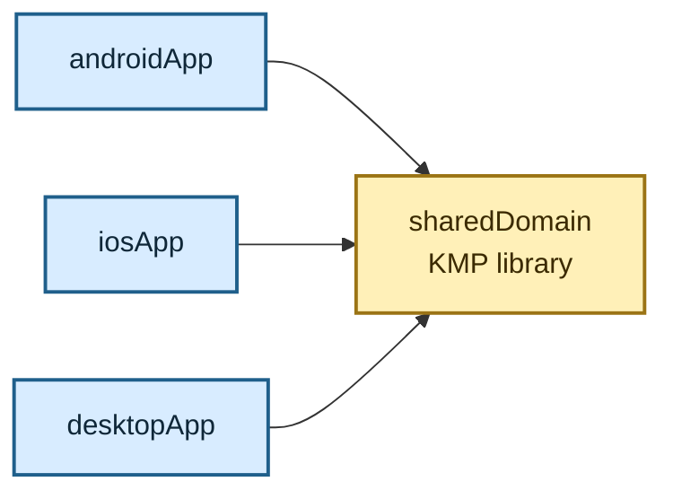

# 17. Three Layer KMP Domain Simple

Simplified domain-sharing view. The app modules depend on one shared domain KMP module.

```mermaid
flowchart LR
  Android["androidApp"]
  IOS["iosApp"]
  Desktop["desktopApp"]
  SharedDomain["sharedDomain\nKMP library"]

  Android --> SharedDomain
  IOS --> SharedDomain
  Desktop --> SharedDomain

  classDef app fill:#d8ecff,stroke:#1f5f8b,color:#0f2738,stroke-width:2px;
  classDef shared fill:#fff0b8,stroke:#9b7415,color:#3b2a00,stroke-width:2px;
  class Android,IOS,Desktop app;
  class SharedDomain shared;
```

