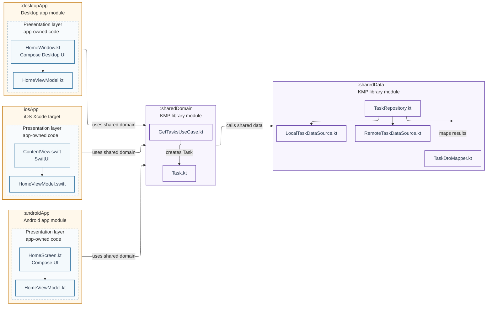

# 18. Three Layer KMP Domain And Data

Domain and data are shared. Each app target keeps an app-owned presentation layer containing UI and ViewModel.

```mermaid
---
config:
  layout: elk
  elk:
    nodePlacementStrategy: LINEAR_SEGMENTS
---
flowchart LR
  subgraph Android[":androidApp\nAndroid app module"]
    direction TB
    subgraph APresentation["Presentation layer\napp-owned code"]
      direction TB
      AUI["HomeScreen.kt\nCompose UI"]
      AVM["HomeViewModel.kt"]
      AUI --> AVM
    end
  end

  subgraph IOS["iosApp\niOS Xcode target"]
    direction TB
    subgraph IPresentation["Presentation layer\napp-owned code"]
      direction TB
      IUI["ContentView.swift\nSwiftUI"]
      IVM["HomeViewModel.swift"]
      IUI --> IVM
    end
  end

  subgraph Desktop[":desktopApp\nDesktop app module"]
    direction TB
    subgraph DPresentation["Presentation layer\napp-owned code"]
      direction TB
      DUI["HomeWindow.kt\nCompose Desktop UI"]
      DVM["HomeViewModel.kt"]
      DUI --> DVM
    end
  end

  subgraph Domain[":sharedDomain\nKMP library module"]
    direction TB
    UseCase["GetTasksUseCase.kt"]
    Entity["Task.kt"]
    UseCase -->|"creates Task"| Entity
  end

  subgraph Data[":sharedData\nKMP library module"]
    direction TB
    Repository["TaskRepository.kt"]
    Remote["RemoteTaskDataSource.kt"]
    Cache["LocalTaskDataSource.kt"]
    Mapper["TaskDtoMapper.kt"]
    Repository --> Remote
    Repository --> Cache
    Repository -->|"maps results"| Mapper
  end

  Desktop -->|"uses shared domain"| Domain
  IOS -->|"uses shared domain"| Domain
  Android -->|"uses shared domain"| Domain
  Domain -->|"calls shared data"| Data

  classDef app fill:#f3f9fc,stroke:#2b6f9e,color:#334155,stroke-width:1.4px;
  classDef kmp fill:#f8f5fe,stroke:#6e4bae,color:#334155,stroke-width:1.4px;
  class AUI,AVM,IUI,IVM,DUI,DVM app;
  class UseCase,Entity,Repository,Remote,Cache,Mapper kmp;
  style Android fill:#fff8eb,stroke:#c47a12,stroke-width:1.6px
  style IOS fill:#fff8eb,stroke:#c47a12,stroke-width:1.6px
  style Desktop fill:#fff8eb,stroke:#c47a12,stroke-width:1.6px
  style APresentation fill:#f8fbfd,stroke:#8aa7bc,stroke-width:1.2px,stroke-dasharray:5 4
  style IPresentation fill:#f8fbfd,stroke:#8aa7bc,stroke-width:1.2px,stroke-dasharray:5 4
  style DPresentation fill:#f8fbfd,stroke:#8aa7bc,stroke-width:1.2px,stroke-dasharray:5 4
  style Domain fill:#f8f5fe,stroke:#6e4bae,stroke-width:1.6px
  style Data fill:#f8f5fe,stroke:#6e4bae,stroke-width:1.6px
```
