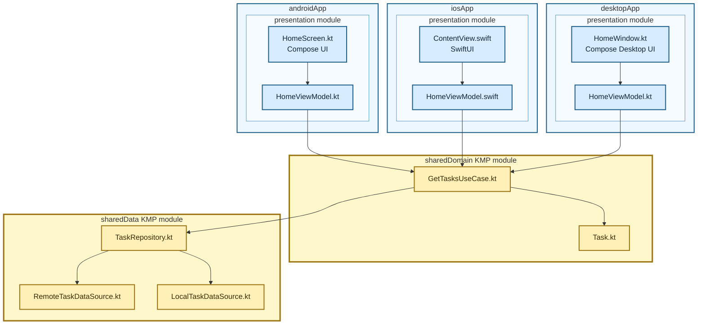

# 18. Three Layer KMP Domain And Data

Domain and data are shared. Native presentation contains UI and ViewModel.

```mermaid
flowchart TB
  subgraph Android["androidApp"]
    direction TB
    subgraph APresentation["presentation module"]
      direction TB
      AUI["HomeScreen.kt\nCompose UI"]
      AVM["HomeViewModel.kt"]
      AUI --> AVM
    end
  end

  subgraph IOS["iosApp"]
    direction TB
    subgraph IPresentation["presentation module"]
      direction TB
      IUI["ContentView.swift\nSwiftUI"]
      IVM["HomeViewModel.swift"]
      IUI --> IVM
    end
  end

  subgraph Desktop["desktopApp"]
    direction TB
    subgraph DPresentation["presentation module"]
      direction TB
      DUI["HomeWindow.kt\nCompose Desktop UI"]
      DVM["HomeViewModel.kt"]
      DUI --> DVM
    end
  end

  subgraph Domain["sharedDomain KMP module"]
    direction LR
    UseCase["GetTasksUseCase.kt"]
    Entity["Task.kt"]
    UseCase --> Entity
  end

  subgraph Data["sharedData KMP module"]
    direction LR
    Repository["TaskRepository.kt"]
    Remote["RemoteTaskDataSource.kt"]
    Cache["LocalTaskDataSource.kt"]
    Repository --> Remote
    Repository --> Cache
  end

  AVM --> UseCase
  IVM --> UseCase
  DVM --> UseCase
  UseCase --> Repository

  classDef app fill:#d8ecff,stroke:#1f5f8b,color:#0f2738,stroke-width:2px;
  classDef kmp fill:#fff0b8,stroke:#9b7415,color:#3b2a00,stroke-width:2px;
  class AUI,AVM,IUI,IVM,DUI,DVM app;
  class UseCase,Entity,Repository,Remote,Cache kmp;
  style Android fill:#edf7ff,stroke:#1f5f8b,stroke-width:2px
  style IOS fill:#edf7ff,stroke:#1f5f8b,stroke-width:2px
  style Desktop fill:#edf7ff,stroke:#1f5f8b,stroke-width:2px
  style APresentation fill:#f6fbff,stroke:#5f97bd,stroke-width:1px
  style IPresentation fill:#f6fbff,stroke:#5f97bd,stroke-width:1px
  style DPresentation fill:#f6fbff,stroke:#5f97bd,stroke-width:1px
  style Domain fill:#fff7cc,stroke:#9b7415,stroke-width:3px
  style Data fill:#fff7cc,stroke:#9b7415,stroke-width:3px
```
