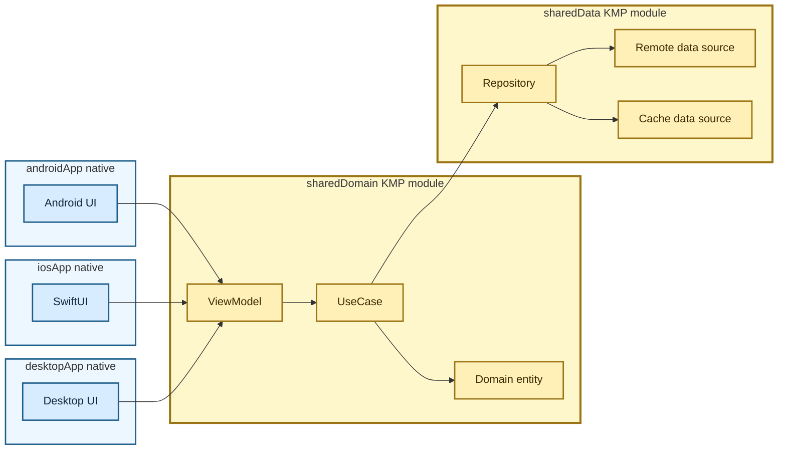

# 18. Three Layer KMP Domain And Data

Domain and data are shared. Platform app modules own the UI.

```mermaid
flowchart LR
  subgraph Android["androidApp native"]
    AndroidUI["Android UI"]
  end

  subgraph IOS["iosApp native"]
    IOSUI["SwiftUI"]
  end

  subgraph Desktop["desktopApp native"]
    DesktopUI["Desktop UI"]
  end

  subgraph Domain["sharedDomain KMP module"]
    direction LR
    VM["ViewModel"]
    UseCase["UseCase"]
    Entity["Domain entity"]
    VM --> UseCase --> Entity
  end

  subgraph Data["sharedData KMP module"]
    direction LR
    Repository["Repository"]
    Remote["Remote data source"]
    Cache["Cache data source"]
    Repository --> Remote
    Repository --> Cache
  end

  AndroidUI --> VM
  IOSUI --> VM
  DesktopUI --> VM
  UseCase --> Repository

  classDef app fill:#d8ecff,stroke:#1f5f8b,color:#0f2738,stroke-width:2px;
  classDef kmp fill:#fff0b8,stroke:#9b7415,color:#3b2a00,stroke-width:2px;
  class AndroidUI,IOSUI,DesktopUI app;
  class VM,UseCase,Entity,Repository,Remote,Cache kmp;
  style Android fill:#edf7ff,stroke:#1f5f8b,stroke-width:2px
  style IOS fill:#edf7ff,stroke:#1f5f8b,stroke-width:2px
  style Desktop fill:#edf7ff,stroke:#1f5f8b,stroke-width:2px
  style Domain fill:#fff7cc,stroke:#9b7415,stroke-width:3px
  style Data fill:#fff7cc,stroke:#9b7415,stroke-width:3px
```
