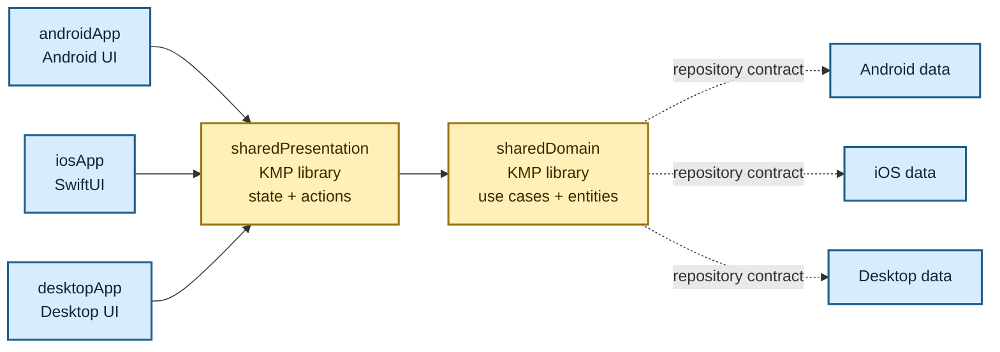

# 19. Three Layer KMP Domain And Presentation

Domain and presentation are shared. Data remains platform-specific.

```mermaid
flowchart LR
  SharedPresentation["sharedPresentation\nKMP library\nstate + actions"]
  SharedDomain["sharedDomain\nKMP library\nuse cases + entities"]
  SharedPresentation --> SharedDomain

  Android["androidApp\nAndroid UI"]
  IOS["iosApp\nSwiftUI"]
  Desktop["desktopApp\nDesktop UI"]

  AndroidData["Android data"]
  IOSData["iOS data"]
  DesktopData["Desktop data"]

  Android --> SharedPresentation
  IOS --> SharedPresentation
  Desktop --> SharedPresentation

  SharedDomain -. "repository contract" .-> AndroidData
  SharedDomain -. "repository contract" .-> IOSData
  SharedDomain -. "repository contract" .-> DesktopData

  classDef app fill:#d8ecff,stroke:#1f5f8b,color:#0f2738,stroke-width:2px;
  classDef shared fill:#fff0b8,stroke:#9b7415,color:#3b2a00,stroke-width:2px;
  class Android,IOS,Desktop,AndroidData,IOSData,DesktopData app;
  class SharedPresentation,SharedDomain shared;
```

