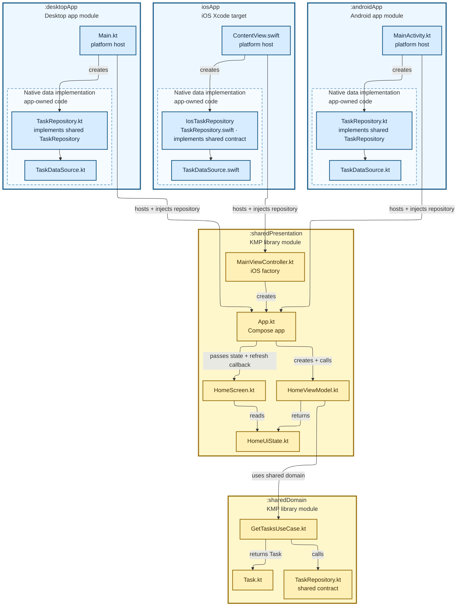

# 19. Three Layer KMP Domain And Presentation

Domain and presentation are shared. Presentation contains shared Compose UI and ViewModel; data implementations remain native.

```mermaid
---
config:
  layout: elk
  elk:
    nodePlacementStrategy: LINEAR_SEGMENTS
---
flowchart TB
  subgraph Android[":androidApp\nAndroid app module"]
    direction TB
    AEntry["MainActivity.kt\nplatform host"]
    subgraph AData["Native data implementation\napp-owned code"]
      direction TB
      ARepository["TaskRepository.kt\nimplements shared TaskRepository"]
      ADataSource["TaskDataSource.kt"]
      ARepository --> ADataSource
    end
    AEntry -->|"creates"| ARepository
  end

  subgraph IOS["iosApp\niOS Xcode target"]
    direction TB
    IEntry["ContentView.swift\nplatform host"]
    subgraph IData["Native data implementation\napp-owned code"]
      direction TB
      IRepository["IosTaskRepository\nTaskRepository.swift · implements shared contract"]
      IDataSource["TaskDataSource.swift"]
      IRepository --> IDataSource
    end
    IEntry -->|"creates"| IRepository
  end

  subgraph Desktop[":desktopApp\nDesktop app module"]
    direction TB
    DEntry["Main.kt\nplatform host"]
    subgraph DData["Native data implementation\napp-owned code"]
      direction TB
      DRepository["TaskRepository.kt\nimplements shared TaskRepository"]
      DDataSource["TaskDataSource.kt"]
      DRepository --> DDataSource
    end
    DEntry -->|"creates"| DRepository
  end

  subgraph Presentation[":sharedPresentation\nKMP library module"]
    direction TB
    Controller["MainViewController.kt\niOS factory"]
    App["App.kt\nCompose app"]
    Screen["HomeScreen.kt"]
    VM["HomeViewModel.kt"]
    State["HomeUiState.kt"]
    Controller -->|"creates"| App
    App -->|"creates + calls"| VM
    App -->|"passes state + refresh callback"| Screen
    VM -->|"returns"| State
    Screen -->|"reads"| State
  end

  subgraph Domain[":sharedDomain\nKMP library module"]
    direction TB
    UseCase["GetTasksUseCase.kt"]
    Entity["Task.kt"]
    RepositoryPort["TaskRepository.kt\nshared contract"]
    UseCase -->|"returns Task"| Entity
    UseCase -->|"calls"| RepositoryPort
  end

  DEntry -->|"hosts + injects repository"| App
  IEntry -->|"hosts + injects repository"| Controller
  AEntry -->|"hosts + injects repository"| App
  VM -->|"uses shared domain"| UseCase

  classDef app fill:#d8ecff,stroke:#1f5f8b,color:#0f2738,stroke-width:2px;
  classDef kmp fill:#fff0b8,stroke:#9b7415,color:#3b2a00,stroke-width:2px;
  class AEntry,ARepository,ADataSource,IEntry,IRepository,IDataSource,DEntry,DRepository,DDataSource app;
  class Controller,App,Screen,VM,State,UseCase,Entity,RepositoryPort kmp;
  style Android fill:#edf7ff,stroke:#1f5f8b,stroke-width:3px
  style IOS fill:#edf7ff,stroke:#1f5f8b,stroke-width:3px
  style Desktop fill:#edf7ff,stroke:#1f5f8b,stroke-width:3px
  style AData fill:#f6fbff,stroke:#5f97bd,stroke-width:1.5px,stroke-dasharray:6 4
  style IData fill:#f6fbff,stroke:#5f97bd,stroke-width:1.5px,stroke-dasharray:6 4
  style DData fill:#f6fbff,stroke:#5f97bd,stroke-width:1.5px,stroke-dasharray:6 4
  style Presentation fill:#fff7cc,stroke:#9b7415,stroke-width:3px
  style Domain fill:#fff7cc,stroke:#9b7415,stroke-width:3px
```
